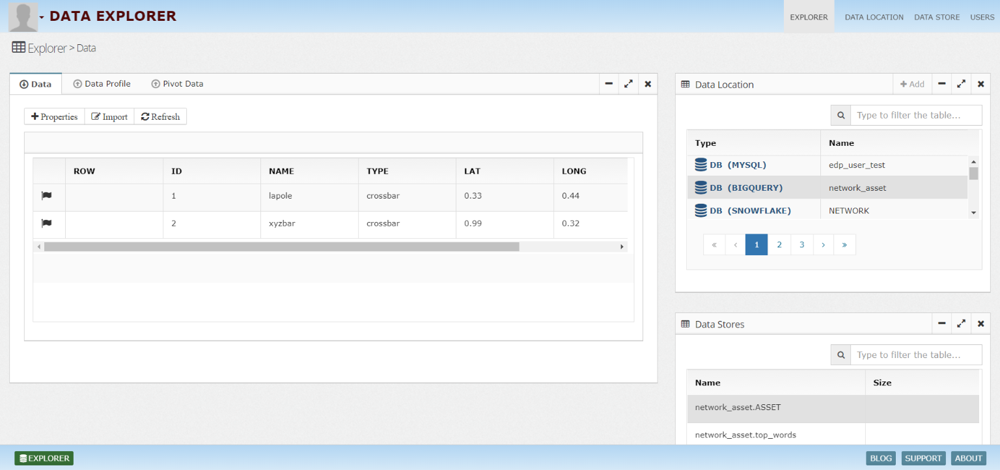
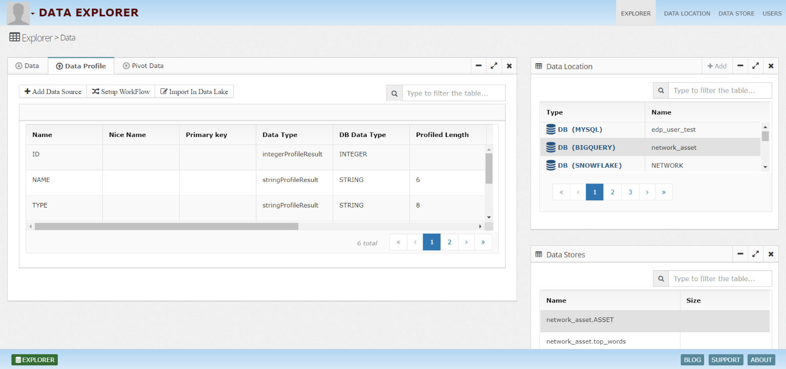
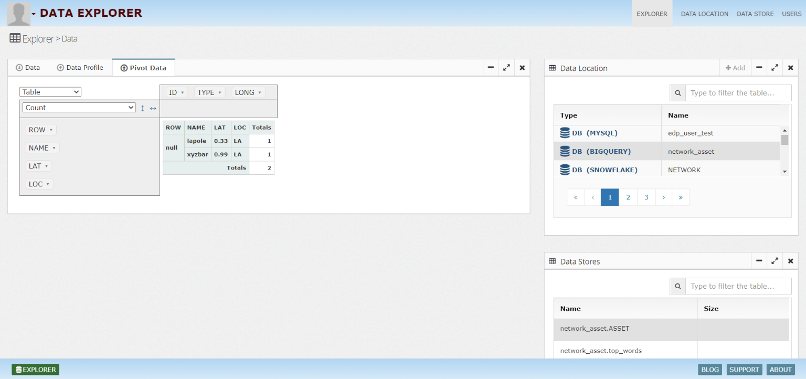
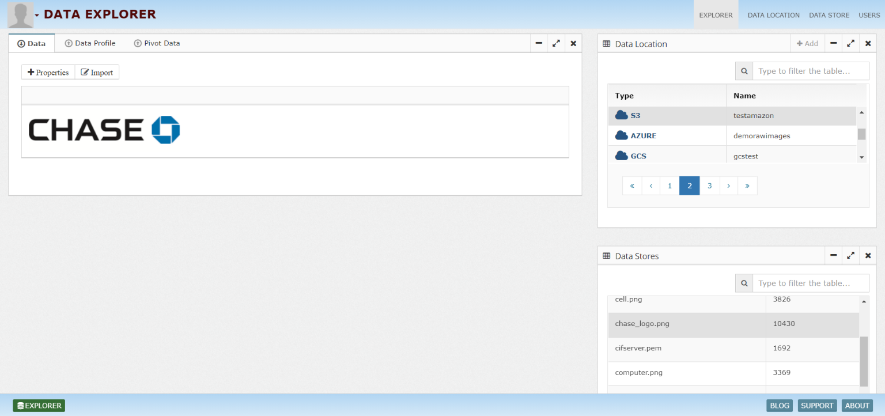
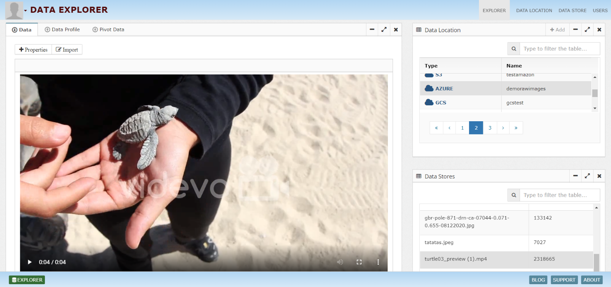
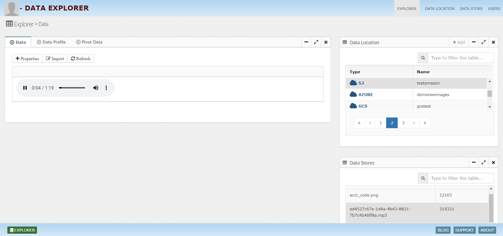
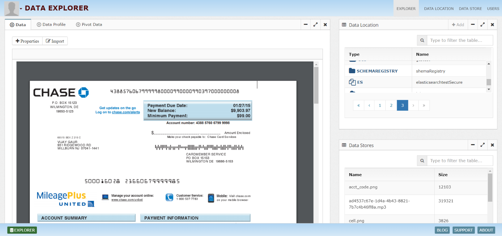
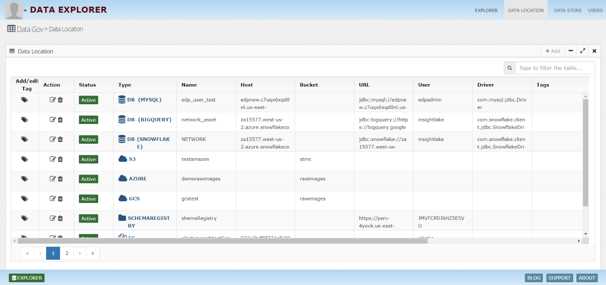
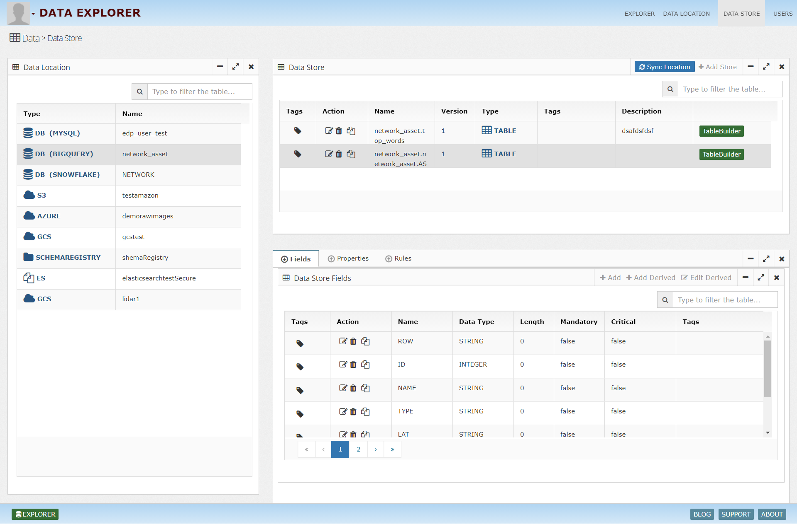
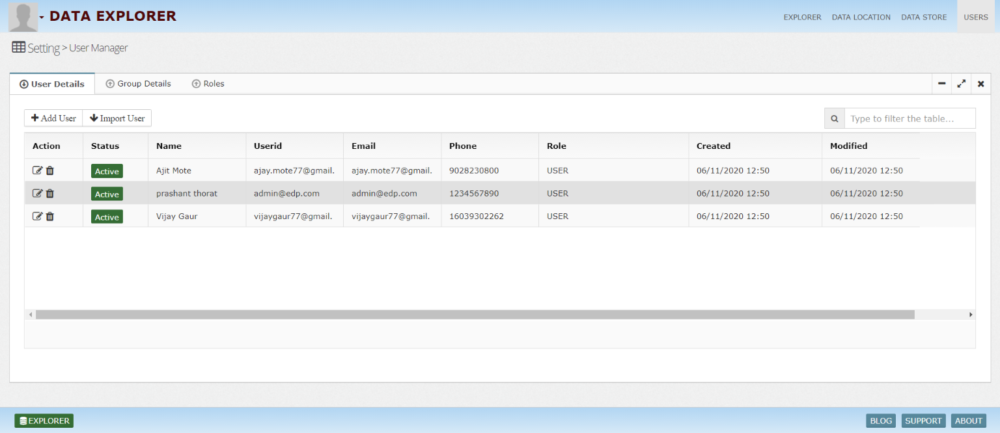

What is InsightLake Data Explorer?
-----------

InsightLake Data Explorer solution is part of InsightLake Data Platform. It provides an intuitive UI and allows users to connect to various data sources and explore the data eaisly.

Users can explore data from diferent sources like:
* File Systems : S3, HDFS, FTP, SFTP
* Relational Databases : Oracle, MySQL, Postgres, SQL Server, DB2
* MPP Databases : Redshift, Impala, Presto
* Big Data : Hive
* NOSQL : Mongo, Hbase, Cassandra
* Search : SOLR, Elastic Search
* Streams : Kafka, Kinesis
* APIs

 ## Explore Data 
   Data Explorer enables data exploration of structured and unstructured data in an intuitive way. Users can view structured data from databases, files (CSV, JSON) or unstructured data like images, videos, audios, documents.

Bellow are some of the examples:

  ### Structured Data
  
 
 
 ### Data Profile View
  Shows data profile, which includes data types and distribution.

 
 
 ### Pivot Data View
  For easier exploration Pivot view is provided

 
 
 ### Image View
  
 
 
 ### Video View
  
 
 
 ### Audio View
  
 
 
 ### PDF View
  
 
 
 ## Data Location
 
 
 
 ## Data Store
 
 
 
 
## Users
 Administrators can manage users, groups and roles to enforce role based access control.
  

To learn more, check out [http://insightlake.com/dataexplorer.html](http://insightlake.com/dataexplorer.html)

Installation
------
* Download or clone the repository. 
* Run bin/insightlake command.
* Open browser with URL as http://localhost:8080/
* Change configuration in /conf folder to set different ports
* By default H2 database is used, you can change the database details in jdbc.properties file

Installation using docker 
------
* Download or clone the repository. 
* cd /docker
* Run `docker-compose -f docker-compose.yaml up --build`
* Open browser with URL as http://localhost:8080/
* While creating Data Location use below credentials  

        * username : root
        * password : password
        * URL :  jdbc:mysql://mysql:3306/

License
------
InsightLake Data Explorer is a commercial product but distributed to be used freely. Please contact contact@insightlake.com for details.

Getting Help
----------

You can get help easily :
Community - Google Groups
Slack Channel
Twitter
Facebook
Email: contact@insightlake.com

