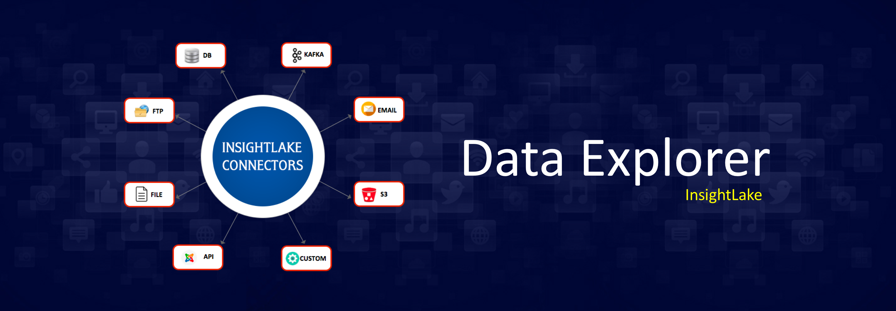

What is InsightLake Data Explorer?
-----------

InsightLake Data Explorer solution is part of InsightLake Data Platform. It provides an intuitive UI and allows users to connect to various data sources and explore the data eaisly.
Users can explore data from diferent sources like:
File Systems : S3, HDFS
Relational Databases : Oracle, MySQL, Postgres, SQL Server, DB2
MPP Databases : Redshift, Impala, Presto
Big Data : Hive
NOSQL : Mongo, Hbase, Cassandra
Search : SOLR, Elastic Search
Streams : Kafka, Kinesis

To learn more, check out [http://insightlake.com/dataexplorer.html](http://insightlake.com/dataexplorer.html)

License
------
InsightLake Data Explorer is a commercial product but distributed to be used freely. Please contact contact@insightlake.com for details.

Getting Help
----------

You can get help easily :
Community - Google Groups
Slack Channel
Twitter
Facebook
Email: contact@insightlake.com

